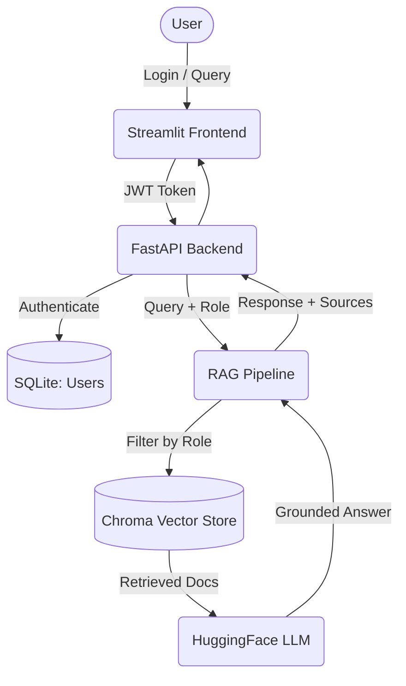

# 🤖 AI Company Internal Chatbot with RBAC & RAG


A production-ready Internal Company Chatbot demonstrating **Retrieval-Augmented Generation (RAG)** and **Role-Based Access Control (RBAC)**. 

Designed for security and precision, this system ensures that employees from different departments (Finance, HR, Engineering, etc.) can query massive sets of company documents using an AI chatbot—while strictly ensuring they **only receive answers constructed from documents they are authorized to access**.

---

## 🌟 Key Features

- **End-to-End Security:** JWT-based authentication system backed by an SQLite database.
- **Role-Based Access Control (RBAC):** Users are dynamically assigned roles that restrict vector database subsets. Finance users cannot see Engineering documents, but C-Level executives can query everything.
- **RAG Pipeline:** Uses `ChromaDB` for vector storage and `Sentence-Transformers` for local, fast embeddings.
- **Dynamic Text Generation:** Connects to free open-source LLMs hosted on HuggingFace for rapid inferencing. 
- **Citations & Grounding:** The chatbot provides verifiable exact source documents alongside its generated answers.
- **Frontend & Backend Decoupling:** Streamlit UI seamlessly integrates with a standalone FastAPI backend.

---

## 🏗️ System Architecture



---

## 🛠️ Tech Stack

- **Backend:** FastAPI, Python, SQLAlchemy, JWT/Passlib
- **Frontend:** Streamlit
- **AI / LLM Framework:** LangChain, HuggingFace Inference Endpoints (`google/flan-t5-large` or Mistral)
- **Vector Database:** ChromaDB
- **Embeddings:** `sentence-transformers/all-MiniLM-L6-v2` (Runs 100% locally)

---

## 🚀 Setup Instructions

### 1. Prerequisites 
- Python 3.9+
- A free [Hugging Face API Token](https://huggingface.co/settings/tokens)

### 2. Clone the Repository
```bash
git clone https://github.com/your-username/AI_Company-Internal-Chatbot-with-Role-Based-Access-Control.git
cd AI_Company-Internal-Chatbot-with-Role-Based-Access-Control
```

### 3. Create a Virtual Environment & Install Dependencies
```bash
python -m venv venv
source venv/bin/activate  # On Windows use `venv\Scripts\activate`
pip install -r requirements.txt
```

### 4. Configure Environment Variables
Create a `.env` file in the root directory and add the following:
```env
HUGGINGFACEHUB_API_TOKEN=your_huggingface_token
JWT_SECRET=supersecretkey_change_in_production
```

### 5. Ingest Data into Vector Database
The repository comes equipped with a script that pulls markdown and CSV data, chunks the data, applies Department-Role metadata rules, and creates the Chroma vector store.
```bash
python utils/data_processor.py
```
*(Note: It will download the embedding model on the first run, which may take a few moments.)*

### 6. Start the Application
You need two terminal windows to run the frontend and backend simultaneously.

**Terminal 1 (Backend):**
```bash
python -m uvicorn backend.main:app --reload --port 8000
```
*Tip: Starting the FastAPI backend for the first time will automatically seed the SQLite database with test users.*

**Terminal 2 (Frontend):**
```bash
python -m streamlit run frontend/app.py
```

---

## 🧪 Testing the Application

Navigate to `http://localhost:8501` in your browser. Use any of the pre-configured accounts below to test the RBAC capabilities. Try asking a Finance-related question as an HR user to see the security in action!

| Username | Password | Role | Document Access Level |
|---|---|---|---|
| `finance_user` | `pass123` | Finance | Finance + General |
| `hr_user` | `pass123` | HR | HR + General |
| `eng_user` | `pass123` | Engineering | Engineering + General |
| `marketing_user` | `pass123` | Marketing | Marketing + General |
| `employee_user` | `pass123` | Employee | General only |
| `c_level_user` | `pass123` | C-Level | **All documents** |

---

## 📁 Directory Structure
```text
.
├── backend/
│   ├── main.py          # FastAPI application and endpoints
│   ├── auth.py          # JWT generation and validation
│   ├── models.py        # SQLAlchemy Database models
│   ├── database.py      # SQLite Connection
│   ├── rag_pipeline.py  # LangChain RAG logic & Document Retrieval
│   └── rbac.py          # Middleware protecting endpoints
├── frontend/
│   └── app.py           # Streamlit Chat interface
├── data/
│   └── Fintech-data/    # Raw markdown and CSV data source
├── utils/
│   └── data_processor.py# Chunker, Metadata assigner, Vector Embedder
├── vectorstore/         # ChromaDB persistence folder
├── requirements.txt
├── .env                 
└── README.md
```

---
*Built as a showcase for integrating AI with strict enterprise security constraints.*
